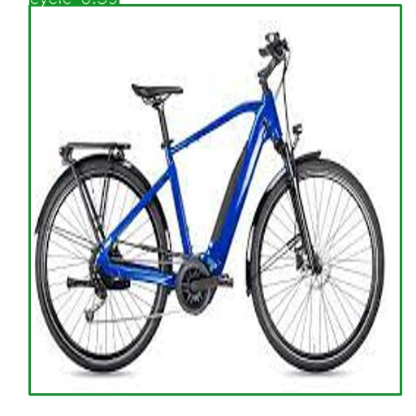

# EVA8 Session 12 Assignment CLIP + Object Localisation

## Problem Statement

1. OpenCV Yolo: [SOURCE](https://pysource.com/2019/06/27/yolo-object-detection-using-opencv-with-python/)  
    1. Run this above code on your laptop or Colab.  
    2. Take an image of yourself, holding another object which is there in COCO data set (search for COCO classes to learn).  
    3. Run this image through the code above.  
    4. Upload the link to GitHub implementation of this  
    5. Upload the annotated image by YOLO. 
2. Training Custom Dataset on Colab for YoloV3  
    1. Refer to this Colab File: [LINK](https://colab.research.google.com/drive/1LbKkQf4hbIuiUHunLlvY-cc0d_sNcAgS)
    2. Refer to this GitHub [Repo](https://github.com/theschoolofai/YoloV3)
    3. Download this [dataset](https://drive.google.com/file/d/1sVSAJgmOhZk6UG7EzmlRjXfkzPxmpmLy/view?usp=sharing). This was annotated by EVA5 Students. Collect and add 25 images for the following 4 classes into the dataset shared:  
        1. class names are in custom.names file.   
        2. you must follow exact rules to make sure that you can train the model. Steps are explained in the README.md file on github repo link above.  
        3. Once you add your additional 100 images, train the model  
    4. Once done:  
        1. [Download](https://www.y2mate.com/en19) a very small (~10-30sec) video from youtube which shows your classes. 
        2. Use [ffmpeg](https://en.wikibooks.org/wiki/FFMPEG_An_Intermediate_Guide/image_sequence) to extract frames from the video.  
        3. Upload on your drive (alternatively you could be doing all of this on your drive to save upload time)
        4. Infer on these images using detect.py file. **Modify** detect.py file if your file names do not match the ones mentioned on GitHub.  
        python detect.py --conf-three 0.3 --output output_folder_name
        5. Use  [ffmpeg](https://en.wikibooks.org/wiki/FFMPEG_An_Intermediate_Guide/image_sequence) to convert the files in your output folder to video
        6. Upload the video to YouTube. 
        7. Also run the model on 16 images that you have collected (4 for each class)  
    5. Share the link to your GitHub project with the steps mentioned above - 1000 pts (only if all the steps were done, and it resulted in a trained model that you could run on video/images)  
    6. Share the link to your YouTube video - 500 pts  
    7. Share the link of your YouTube video shared on LinkedIn, Instagram, medium, etc! You have no idea how much you'd love people complimenting you! [TOTALLY OPTIONAL] - bonus points  
    8. Share the link to the readme file where we can find the result of your model on YOUR 16 images. - 500 pts. 

3. Bonus: [YoloV4 Training on Colab!](https://colab.research.google.com/drive/1b08y_nUYv5UtDY211NFfINY7Hy_pgZDt#scrollTo=1YW7jPF1BOAw). 

## Solution - Part 1, OpenCV

OpenCV with YOLO has been used for object detection, (results are outstanding in real-time conditions)

- Colab notebook: [link](./EVA8_Session12_OpenCV.ipynb)  
- Annotated image  

## Solution - Part 2, Training YoloV3 on Custom data

In this section, the idea is to build object-detection application (using/training YOLO model) on custom data: Tom, Jerry, Cycle and Car.

1. Custom data collection: Gathering images containing the desired objects (Tom, Jerry, Cycle and Car) for the custom dataset. (Only .jpg images are preferred.)
2. Annotation: Annotating the custom dataset using appropriate labeling tools, ensuring the format matches the YoloV3 requirements. The annotation tool for this project can be found here [link](https://github.com/miki998/YoloV3_Annotation_Tool)
3. Customizing YOLO configuration file and dataset files: Adapting the YOLO configuration file to accommodate the custom dataset, including changes in the number of classes and filters, and updating the class names and train.txt files.
4. Updating last layer classes and filters: Modifying the last layer to match the number of custom classes (4 in this case) and updating the second last layer filters as 3 * (4 + 1 + 4(4 classes in our project)) = 27.  
5. Training YoloV3 with PyTorch: Initializing the training with pre-trained weights from the COCO dataset and then re-training the model on the custom dataset, resulting in a customized object detection model for our specific use case.  

The Colab notebook for this implementation can be found [here](./EVA8_Session12_YOLO_Custom_Data.ipynb).

Link to your YouTube video: [link] (https://www.youtube.com/watch?v=vMwX8SZHqu4)
https://www.youtube.com/watch?v=vMwX8SZHqu4

The results of the model on the 16 collected images (4 for each class),

**Tom** 

|  |  |
|------------------------|------------------------|
|  |  |

**Jerry** 

|  |  |
|------------------------|------------------------|
|  |  |

**Cycle** 

|  |  |
|------------------------|------------------------|
|  |  |

**Car** 

|  |  |
|------------------------|------------------------|
|  |  |
